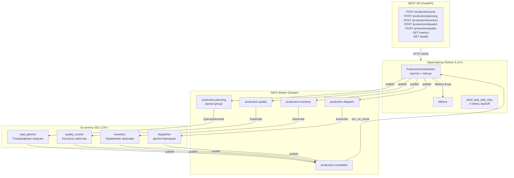
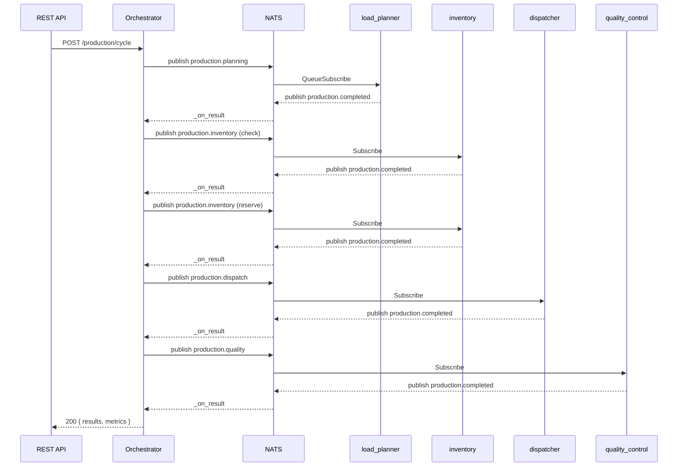

# Лабораторная работа №13. Мультиагентные системы: разработка распределённых интеллектуальных агентов
**Студент:** *Платов Артем Русланович*\
**Группа:** *220032-11*\
**Вариант:** *16*\
**Сложность:** *Средняя*
---
# Управление производством

## Архитектура



### Диаграмма последовательности (производственный цикл)



### Компоненты системы

| Компонент | Язык | Технологии | Роль |
|---|---|---|---|
| **REST API** | Python 3.13+ | FastAPI, Pydantic, uvicorn | HTTP-интерфейс для запуска задач, валидация запросов, метрики |
| **Оркестратор** | Python 3.13+ | asyncio, nats-py | Координация 5-шагового workflow, таймауты, ретраи, демо-режим |
| **load_planner** | Go 1.24+ | NATS, QueueSubscribe | Планирование загрузки производственных мощностей |
| **quality_control** | Go 1.24+ | NATS | Контроль качества выпущенной продукции |
| **inventory** | Go 1.24+ | NATS | Управление складскими запасами |
| **dispatcher** | Go 1.24+ | NATS | Диспетчеризация заданий по производственным линиям |
| **NATS** | — | Docker | Асинхронный брокер сообщений (sub/pub) |

### Агенты и их бизнес-логика

#### 1. Планирование загрузки (`load_planner`)
- **Subject**: `production.planning` (Queue group: `planning-workers`)
- **Вход**: `{ order_id, product, quantity, deadline, priority }`
- **Выход**: `{ order_id, feasible, schedule, total_time_mins, utilization_pct }`
- **Правила**:
  - Приоритет влияет на скорость обработки (critical ×2.0, high ×1.5, normal ×1.0, low ×0.5)
  - Загрузка станка не более 100%
  - Технологический перерыв 15 мин между операциями
  - Если deadline нереалистичен → `feasible: false` с рекомендацией
  - Critical-заказы выполняются даже при превышении дедлайна
  - **Балансировка**: QueueSubscribe распределяет задачи между экземплярами (AGENT_ID)

#### 2. Контроль качества (`quality_control`)
- **Subject**: `production.quality`
- **Вход**: `{ batch_id, product, quantity, measurements }`
- **Выход**: `{ batch_id, status, defect_rate, passed_pct, defects }`
- **Правила**:
  - Допуск: ±5% для обычных, ±1% для критических параметров
  - Если `defect_rate > 10%` или есть critical-дефект → `rejected`
  - Если `3% < defect_rate ≤ 10%` → `rework`
  - Выборочный контроль: 20% от партии, но не менее 10 единиц
  - Если измерения не переданы — генерируются автоматически

#### 3. Управление запасами (`inventory`)
- **Subject**: `production.inventory`
- **Вход**: `{ request_type: "check"|"reserve"|"restock", material, required_qty }`
- **Выход**: `{ request_id, status, available_qty, reserved_qty, safety_stock }`
- **Правила**:
  - Страховой запас: 15% от среднемесячного расхода
  - При дефиците автоматически оформляется заказ поставщику
  - Время поставки зависит от материала (2–14 дней)
  - Три режима: check (проверка), reserve (резервирование), restock (пополнение)

#### 4. Диспетчеризация (`dispatcher`)
- **Subject**: `production.dispatch`
- **Вход**: `{ order_id, schedule, priority, start_after }`
- **Выход**: `{ order_id, dispatch_id, lines, overall_status }`
- **Правила**:
  - Задание назначается на линию с наименьшей загрузкой
  - Одна линия — одно задание за раз
  - Если линия занята — задание ставится в очередь
  - Critical/high приоритет может прерывать выполнение обычных заказов
  - При пустом расписании генерируется расписание по умолчанию

### Управление экземплярами и нагрузкой

**Балансировка (Task 7):**
- `load_planner` использует `QueueSubscribe("production.planning", "planning-workers")`
- NATS автоматически распределяет задачи round-robin между экземплярами
- `AGENT_ID` env var идентифицирует каждый экземпляр в логах и ответах

```
load_planner_1: 2 задачи
load_planner_2: 3 задачи
load_planner_3: 1 задача  ← 6 задач распределены между 3 инстансами
```

### Производственный workflow (оркестрация)

```
ШАГ 1: production.planning   → Планирование загрузки       (timeout: 15с, retry: 3)
ШАГ 2: production.inventory  → Проверка запасов (check)    (timeout: 10с, retry: 3)
ШАГ 3: production.inventory  → Резерв материалов (reserve) (timeout: 10с, retry: 3)
ШАГ 4: production.dispatch   → Диспетчеризация             (timeout: 15с, retry: 3)
ШАГ 5: production.quality    → Контроль качества            (timeout: 15с, retry: 3)
```

Каждый шаг использует `send_task_with_retry`: до 3 попыток с backoff (2с, 4с, 6с).

---

## Установка и запуск

### Требования

- [Go](https://go.dev/dl/) 1.24+
- [Python](https://www.python.org/downloads/) 3.13+
- [Docker Desktop](https://www.docker.com/products/docker-desktop/)
- [Task](https://taskfile.dev/) (опционально, для автоматизации)

### 1. Клонирование

```bash
git clone <repository-url> lab5
cd lab5
```

### 2. Установка зависимостей

```bash
# Go-зависимости (агенты)
go mod download

# Python-зависимости (оркестратор)
pip install -r orchestrator/requirements.txt
```

### 3. Запуск NATS

```bash
docker compose up -d
```

Проверка: `curl http://localhost:8222` — мониторинг NATS.

### 4. Запуск агентов

В отдельных терминалах (или фоновых процессах):

```bash
# Терминал 1: Планирование загрузки
go run ./agents/cmd/load_planner/

# Терминал 2: Контроль качества
go run ./agents/cmd/quality_control/

# Терминал 3: Управление запасами
go run ./agents/cmd/inventory/

# Терминал 4: Диспетчеризация
go run ./agents/cmd/dispatcher/
```

Или соберите и запустите бинарники:

```bash
go build -o agents/bin/ ./agents/cmd/...
./agents/bin/load_planner.exe &
./agents/bin/quality_control.exe &
./agents/bin/inventory.exe &
./agents/bin/dispatcher.exe &
```

### 5. Запуск оркестратора

```bash
# Полный производственный цикл (с NATS и агентами)
python orchestrator/orchestrator.py

# Демо-режим (без NATS)
python orchestrator/orchestrator.py --demo
```

---

## Коммуникация (NATS Subjects)

| Subject | Направление | Назначение |
|---|---|---|
| `production.planning` | Оркестратор → Агент | Задачи планирования загрузки |
| `production.quality` | Оркестратор → Агент | Задачи контроля качества |
| `production.inventory` | Оркестратор → Агент | Задачи управления запасами |
| `production.dispatch` | Оркестратор → Агент | Задачи диспетчеризации |
| `production.completed` | Агент → Оркестратор | Результаты от всех агентов |

### Формат сообщений

**Задача (Task)**:
```json
{
  "id": "uuid",
  "type": "planning",
  "payload": "{...}"  // JSON-строка с данными конкретного агента
}
```

**Результат (Result)**:
```json
{
  "task_id": "uuid",
  "success": true,
  "output": "{...}",  // JSON-строка с результатом
  "agent": "load_planner"
}
```

---

## Тестирование

### Go-тесты агентов (49 тестов)

```bash
# Все тесты
go test ./agents/... -v

# Отдельный агент
go test ./agents/cmd/load_planner/ -v
go test ./agents/cmd/quality_control/ -v
go test ./agents/cmd/inventory/ -v
go test ./agents/cmd/dispatcher/ -v
go test ./agents/shared/ -v
```

| Пакет | Тестов | Что покрывают |
|---|---|---|---|
| `shared` | 19 | JSON-сериализация Task/Result, AgentLogger, Metrics, concurency, граничные случаи |
| `load_planner` | 7 | Приоритеты, дедлайны, граничные случаи, утилизация |
| `quality_control` | 9 | Допуски, статусы (passed/rework/rejected), границы 0%/100%, генерация выборки |
| `inventory` | 9 | Check/reserve/restock, неизвестные материалы, состояние склада |
| `dispatcher` | 8 | Расписания, очереди, прерывания, утилиты itoa/stringsEqualFold |

### Python-тесты оркестратора (31 тест)

```bash
cd orchestrator
pip install -r requirements.txt
pytest test_orchestrator.py -v
```

| Что проверяют |
|---|
| Инициализация, методы send_task / _on_result |
| Таймауты (при отсутствии подписчика) |
| Корректность payload каждого из 5 шагов workflow |
| Устойчивость к частичным отказам, retry-логика (3 попытки, backoff) |
| Параллельные задачи и конкурентные ретраи |
| Ошибка подключения к NATS |
| Класс Metrics (счётчики, summary, report, uptime) |
| Unicode-нагрузка, очистка results после таймаута |
| `__init__` exports |

### Интеграционный тест (NATS e2e)

```bash
# Требует: запущенный NATS + собранные агенты
python test_integration.py
```

Проверяет сквозную коммуникацию: все 4 агента получают задачи через NATS и возвращают корректные ответы.

---

## REST API (FastAPI)

Файл: `orchestrator/api.py`

HTTP-интерфейс для запуска производственных задач через оркестратор.

### Эндпоинты

| Метод | Путь | Описание |
|-------|------|----------|
| `GET` | `/` | Список доступных эндпоинтов |
| `GET` | `/health` | Статус сервиса и подключения к NATS |
| `GET` | `/metrics` | Метрики оркестратора |
| `POST` | `/production/cycle` | Полный производственный цикл (5 шагов) |
| `POST` | `/production/planning` | Планирование загрузки |
| `POST` | `/production/inventory` | Проверка/резерв запасов |
| `POST` | `/production/dispatch` | Диспетчеризация |
| `POST` | `/production/quality` | Контроль качества |

### Пример запроса

```bash
curl -X POST http://localhost:8000/production/cycle \
  -H "Content-Type: application/json" \
  -d '{"order_id":"ORD-001","product":"Шестерня","quantity":500,"priority":"high"}'
```

### Ответ (200 OK)

```json
{
  "order": {
    "order_id": "ORD-001",
    "product": "Шестерня",
    "quantity": 500,
    "deadline": "05:55 23.05.2026",
    "priority": "high"
  },
  "metrics": {
    "tasks_sent": 8,
    "tasks_completed": 5,
    "tasks_timeout": 2,
    "tasks_failed": 0,
    "uptime_sec": 73.3
  },
  "results": {
    "planning": { "success": true, "output": { "feasible": true, ... } },
    "inventory_check": { "success": true, "output": { ... } },
    "inventory_reserve": { "success": true, "output": { ... } },
    "dispatch": { "success": true, "output": { ... } },
    "quality_control": { "success": true, "output": { ... } }
  }
}
```

### Запуск

```bash
uvicorn orchestrator.api:app --host 127.0.0.1 --port 8000
```

---

## Структура проекта

```
lab5/
├── docker-compose.yml              # NATS-сервер
├── go.mod / go.sum                 # Go-модуль (lab5)
├── README.md                       # Документация
├── agents/
│   ├── shared/
│   │   ├── types.go                # Task / Result — общий контракт
│   │   ├── types_test.go           # Тесты типов
│   │   ├── logging.go              # AgentLogger (file+console, INFO/WARN/ERROR)
│   │   ├── logging_test.go         # Тесты логгера и метрик
│   │   └── metrics.go              # Metrics (atomic counters, report)
│   ├── cmd/
│   │   ├── load_planner/
│   │   │   ├── main.go             # Агент планирования загрузки
│   │   │   └── main_test.go        # Тесты (7)
│   │   ├── quality_control/
│   │   │   ├── main.go             # Агент контроля качества
│   │   │   └── main_test.go        # Тесты (9)
│   │   ├── inventory/
│   │   │   ├── main.go             # Агент управления запасами
│   │   │   └── main_test.go        # Тесты (9)
│   │   └── dispatcher/
│   │       ├── main.go             # Агент диспетчеризации
│   │       └── main_test.go        # Тесты (8)
│   └── bin/                        # Скомпилированные бинарники
├── orchestrator/
│   ├── __init__.py                 # Экспорт ProductionOrchestrator, Metrics, setup_logging
│   ├── requirements.txt            # Зависимости Python
│   ├── orchestrator.py             # Оркестратор (473 строки)
│   ├── api.py                      # REST API (FastAPI, 189 строк)
│   ├── test_orchestrator.py        # Тесты оркестратора (13)
│   └── test_orchestrator_extra.py  # Доп. тесты: метрики, ретраи, граничные случаи (18)
├── logs/                           # Логи агентов и оркестратора
└── test_integration.py             # Интеграционный E2E-тест
```

---

## Taskfile (опционально)

Для автоматизации можно использовать [Taskfile](https://taskfile.dev/). Создайте `Taskfile.yml`:

```yaml
version: "3"

tasks:
  deps:
    desc: "Установка зависимостей"
    cmds:
      - go mod download
      - pip install -r orchestrator/requirements.txt

  build:
    desc: "Сборка агентов"
    cmds:
      - go build -o agents/bin/ ./agents/cmd/...

  up:
    desc: "Запуск NATS"
    cmds:
      - docker compose up -d

  down:
    desc: "Остановка NATS"
    cmds:
      - docker compose down

  test:
    desc: "Запуск всех тестов"
    cmds:
      - go test ./agents/... -v
      - pytest orchestrator/test_orchestrator.py -v

  run-orchestrator:
    desc: "Запуск оркестратора"
    cmds:
      - python orchestrator/orchestrator.py

  run-demo:
    desc: "Демо-режим оркестратора"
    cmds:
      - python orchestrator/orchestrator.py --demo
```

---

## Стек технологий

- **Go 1.24** — реализация агентов (конкурентность, NATS-клиент)
- **Python 3.13+** — оркестратор (asyncio, nats-py)
- **NATS** — асинхронный брокер сообщений
- **Docker** — контейнеризация NATS
- **pytest + asyncio** — тестирование Python
- **Go testing** — тестирование Go
